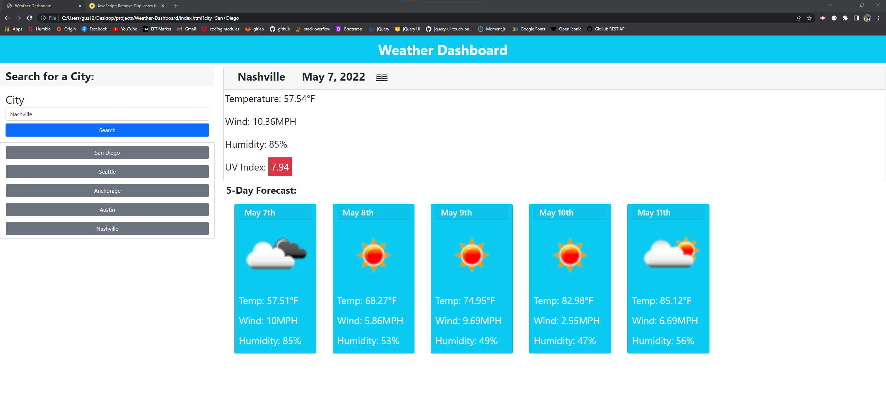

# Weather Dashboard
## Purpose
The purpose of this application is to view a main citie's weather utilizing the server API of oneweather.  
The user is presented with a webpage called "Weather Dashboard".  
When presented they have a search field in which they can enter a city name into the search bar.  
Once entering in the city name they are shown the current date and weather and icon based on cloud layers / precipitation.  
Within the current weather card they will be shown the:
* Temperature in degrees farenheit
* Wind in MPH
* Humidity percentage
* UV index which will be color coded based on the severity of the UV index 
Immediately under that they are shown the 5 day forecast following the next 5 days with the temperature, cloud / weather icon, humidity and wind.  
When the user selects a city they will see the previous cities they selected and be able to click the city and research it being shown that cities weather.  

## Created with 
* HTML
* CSS
* JS
* CSS Framework Bootstrap
* Oneweather API

## Resources
- I used stack overflow and weather websites throughout this project and referenced where I used these in the comments in the project
- I received help from TA's and my tutor

## Moving Forward
- I would like to remove duplicated city names instead of constantly generating the city into the array upon hitting search
- Limit how many cities that populate in the local storage or enable the user to be able to scroll through an infinite amount of cities
- Upon clicking a button in the search history of the cities previously it should automatically generate the city clicked instead of having to select search again
- Make it look nicer 

## Web link:
- Live Link [website](https://gerushays.github.io/Weather-Dashboard/)

## Screenshot

## Contribution
Made by Gerus Hays